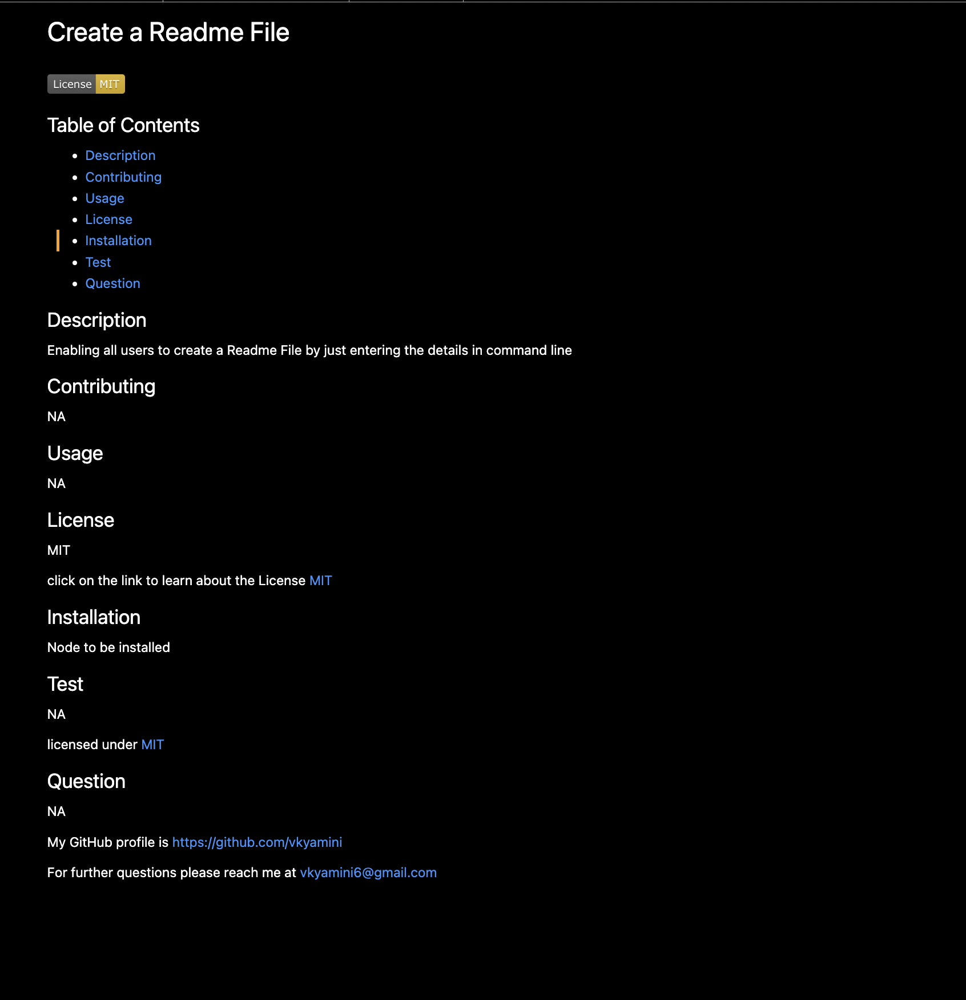

# Generate-readmeFile

## Screenshot

## Table of Contents
  
 - [Description](#Description)
 - [Usage](#Usage)
 - [License](#License)
 - [Questions](#Question)
    
 ## Description
 To generate a readme file when user gives the input
  
 ## Usage
 Eveyone who buildes a project can use readme file
 link : https://drive.google.com/file/d/18mHrZB7MDQOYSAjHKEz4BIgdnj-qQ1Rb/view
  
 ## License
 MIT
  
 ## Question
 My GitHub profile is https://github.com/vkyamiini
 For further questions please reach me at : vkyamini6@gmail.com
